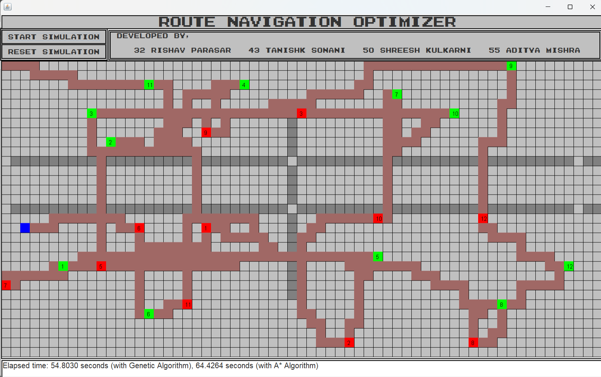

# Dynamic Route Finder using Genetic Algorithm Optimization + A* Search

This project implements a dynamic route-finding tool built with Java Swing. It leverages a hybrid approach combining Genetic Algorithm optimization and A* Search to find efficient paths in various environments, suitable for applications in navigation, robotics, and logistics.

## Table of Contents
- [Overview](#overview)
- [Features](#features)
- [Technologies Used](#technologies-used)
- [Algorithm Details](#algorithm-details)
- [Usage](#usage)
- [Results](#results)
- [Future Improvements](#future-improvements)
- [License](#license)

## Overview
The Dynamic Route Finder is designed for real-time pathfinding solutions. By combining Genetic Algorithms with A* Search, the system offers both exploration capabilities and precision in finding optimized paths, making it adaptable for different scenarios.

## Features
- **Optimized Pathfinding**: Uses Genetic Algorithm and A* to generate dynamic and efficient routes.
- **Graphical User Interface**: Built with Swing for an interactive user experience.
- **Customizable Parameters**: Allows users to adjust parameters for the Genetic Algorithm and A* Search.

## Technologies Used
- **Java**: Main programming language used for development.
- **Swing**: For creating the graphical user interface.
- **Java Collections Framework**: For managing data structures.

## Algorithm Details
1. **Genetic Algorithm Optimization**:
   - **Initial Population**: Generates a random set of potential routes.
   - **Selection**: Uses a fitness function to evaluate and select routes based on distance and obstacles.
   - **Crossover & Mutation**: Combines routes to explore new paths and introduces variability.
   - **Fitness Evaluation**: Assesses each route's effectiveness in reaching the destination.

2. **A* Search Enhancement**:
   - **Heuristic Function**: Utilizes a heuristic to guide the search efficiently toward the goal.
   - **Path Refinement**: A* enhances the best candidates from the Genetic Algorithm for optimal path selection.

## Usage
1. **Launch the Application**: Compile and run the Java application.
2. **Define the Environment**: Set up the map or grid, specifying start and end points, and any obstacles.
3. **Run the Route Finder**: Use the GUI to execute the route-finding algorithm and visualize the results.

## Results
The Dynamic Route Finder effectively balances exploration and accuracy, showcasing robust performance across various environments.

| Metric        | Value        |
|---------------|--------------|
| Average Route Optimization | ~95% |
| Computation Time Reduction | ~40% (compared to A* alone in complex environments) |

Example of route visualization:

## Future Improvements
- **Adaptive Parameters**: Implement methods for dynamic parameter adjustment based on environment complexity.
- **Real-World Data Testing**: Evaluate the algorithm on real-world maps or GPS data.
- **Improved GUI Features**: Enhance the user interface for better interaction and visualization.

## License
This project is licensed under the MIT License - see the [LICENSE](LICENSE) file for details.
